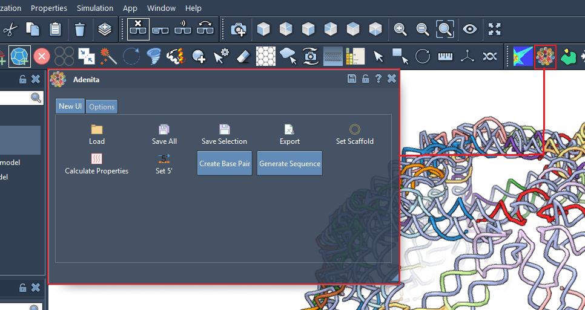
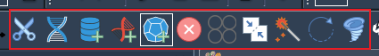
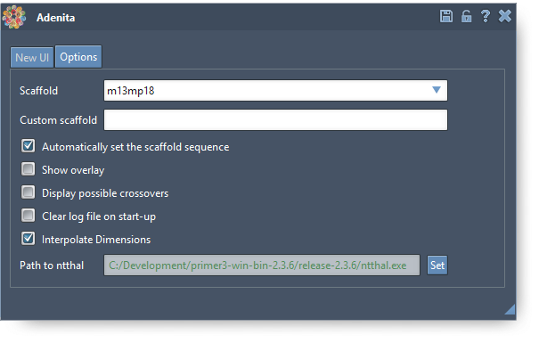
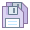
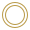
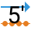
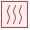
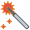

# About Adenita:

Adenita is a 3D visualization and modeling toolkit for the in silico design of static and dynamic DNA nanostructures. Based on a multiscale data model, it visualizes DNA-based structures on different abstraction levels and enable users to load and create DNA origami structures and combine them with proteins.

**Adenita: Interactive 3D modeling and visualization of DNA Nanostructures**
Elisa de Llano, Haichao Miao, Yasaman Ahmadi, Amanda J. Wilson, Morgan Beeby, Ivan Viola, Ivan Barisic
*Pre-print at bioRxiv (849976)*; doi: https://doi.org/10.1101/849976

## Developers:

Adenita, currently in the alpha version, is being developed by Elisa De Llano and Haichao Miao. 

# Adenita: quick-start guide

This document is a quick-start guide to get you started designing DNA nanostructures on Adenita.

1. [Requirements](#requirements)
2. [First steps](#first-steps)
3. [Features](#features)
4. [Adenita UI](#adenita-ui)
5. [**Video tutorials**](#video-tutorials)

## Requirements

Adenita is available for Windows and Linux. A dedicated graphics card is recommended.

## First steps

Adenita SAMSON edition is a [SAMSON](https://www.samson-connect.net) plugin. It is available for **SAMSON 0.7.0** and **SAMSON 0.8.5**. After installing SAMSON, you can select Adenita from a variety of plugins. Adenita can be combined with any of them! If you are unfamiliar with SAMSON, check out their [tutorials](https://documentation.samson-connect.net/).

If you encounter any problems while working with Adenita, you can report them [here](https://github.com/edellano/Adenita-SAMSON-Edition-Win-/issues)

## Features

### Create DNA nanostructures

Use different editors to create dsDNA, nanotubes, lattices or wireframe nanostructures (uses [Daedalus](http://daedalus-dna-origami.org/) algorithm).

### Save components of your design, or the entire design

You can save the entire workspace using SAMSON's save function. If you want to save components of your design for later reuse, use Adenita's saving function (.adnpart).

### Import a DNA nanostructure from Cadnano, or load a previous design

Through the main UI you can load a Cadnano design, or component saved as .adnpart. You can combine as many components as your graphics card and CPU can afford.

### Export your design

Besides being saved, you can export your design as a list of sequences or in oxDNA format for simulations.

## Adenita UI

Once you have installed Adenita the main UI should be located with other applications:

Different editors can be found on the editor menu:

The user can also set some options:

### Main UI

The following functions can be accessed through the main UI:

*  Load a DNA nanostructure from a file. Possible choices are a cadnano design (for cadnano 2.5) as .json, a mesh in .ply (will be loaded using the [Daedalus](http://daedalus-dna-origami.org/) algorithm), or a .adnpart or .adn (custom Adenita formats). This option allows to load a component into a workspace (loading using SAMSON files will create a new document).
* The user can chose to save a component for later use in our custom format (.adnpart).
* The user can save all current DNA nanostructures in a .adn file, systems not handled through Adenita won't be saved.
* Options to export as CSV sequence file or in a format appropiate for oxDNA are available here.
* All scaffolds from the selection will be assigned a sequence specified through the 'Options' menu, scaffold nucleotide's pairs will also be assigned the complementary base.
* It is possible to set any nucleotide as the new 5' of its single strand.
* If a path to [ntthal](https://primer3.org/) has been specified in the Options menu, it will be used to calculate the melting temperatures and Gibbs free energies of all binding regions of a selected component.

### Editors
* Breaks the bond between two consecutive nucleotides of the same strand.
* Deletes nucleotides or base pairs, depending on the chosen visualization scale.
* Merges single or double strands. If strand ends are selected, they will be connected in the appropiate direction (5' to 3'). If nucleotides that are not 5' or 3' are selected, the strands will be broken in order to reconnect them at chosen points. It is also possible to insert a new double or single strand along the connection.
* Reorganize several components into one, or reassign single and double strands to other components. List of components and strands needs to be updated manually.
* Modifies the twist angle of a double-strand along the helical axis.
* Tag nucleotides or modify its base.
* Remove entire the twist of a double strand locally to observe the single strands that compose it as parallel lines.
* Add a new single or double strand as a component to the design. They can also be circular.
* Add a lattice of double strands as a component.
* Add a nanotube composed of double strands.
* Generate a wireframe from the given shapes and add it to the design (uses the [Daedalus](http://daedalus-dna-origami.org/) algorithm).

## Video Tutorials
Getting Started: 
<iframe width="560" height="315" src="https://www.youtube.com/embed/ahf_849SJPg" frameborder="0" allow="accelerometer; autoplay; encrypted-media; gyroscope; picture-in-picture" allowfullscreen></iframe>

Creating ssDNA/dsDNA: 
<iframe width="560" height="315" src="https://www.youtube.com/embed/5JaJaqFgXqY" frameborder="0" allow="accelerometer; autoplay; encrypted-media; gyroscope; picture-in-picture" allowfullscreen></iframe>

Creating Nanotubes and Untwisting: 
<iframe width="560" height="315" src="https://www.youtube.com/embed/4EaM1SbCrV0" frameborder="0" allow="accelerometer; autoplay; encrypted-media; gyroscope; picture-in-picture" allowfullscreen></iframe>

Creating Square/Honeycomb Lattices and Connecting ssDNA: 
<iframe width="560" height="315" src="https://www.youtube.com/embed/jZpCaZHeplE" frameborder="0" allow="accelerometer; autoplay; encrypted-media; gyroscope; picture-in-picture" allowfullscreen></iframe>

Creating DNA Wireframe Structures and Creating All Atom Model: 
<iframe width="560" height="315" src="https://www.youtube.com/embed/ZRT9Qydf6cw" frameborder="0" allow="accelerometer; autoplay; encrypted-media; gyroscope; picture-in-picture" allowfullscreen></iframe>

Load and Visualize Proteins (PDB) & Connect to DNA Wireframe: 
<iframe width="560" height="315" src="https://www.youtube.com/embed/uhVx-I1RfFg" frameborder="0" allow="accelerometer; autoplay; encrypted-media; gyroscope; picture-in-picture" allowfullscreen></iframe>

Highlighting, Tagging:
<iframe width="560" height="315" src="https://www.youtube.com/embed/IC176zUFyzk" frameborder="0" allow="accelerometer; autoplay; encrypted-media; gyroscope; picture-in-picture" allowfullscreen></iframe> 

Icons from: https://icons8.com/icons.  
